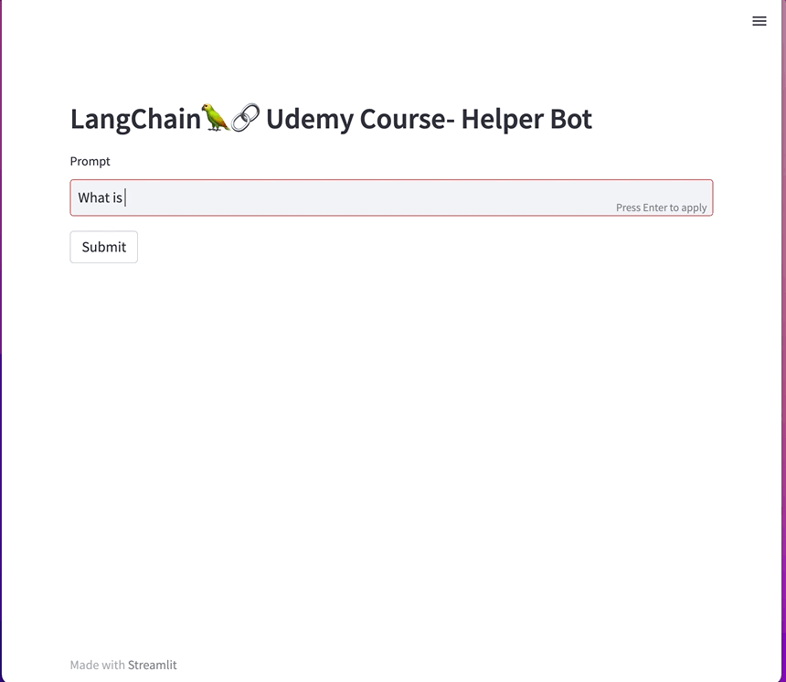

# LangChain Documentation Helper

A repository for learning LangChain by building a generative ai application.

This is a web application is using a Pinecone as a vectorsotre and answers questions about LangChain 
(sources from LangChain official documentation). 





## Environment Variables

To run this project, you will need to add the following environment variables to your .env file

`PINECONE_API_KEY`
`PINECONE_ENVIRONMENT_REGION`
`OPENAI_API_KEY`

## Run Locally

Clone the project

```bash
  git clone https://github.com/saxenaprerit131/documentation-helper.git
```

Go to the project directory

```bash
  cd documentation-helper
```

Keep inputs for Pinecone here
```bash
  mkdir langchain-docs
  wget -r -A.html -P langchain-docs https://python.langchain.com/en/latest/index.html
```

Install dependencies

```bash
  pipenv install
```

Start the flask server

```bash
  streamlit run main.py
```


## Running Tests

To run tests, run the following command

```bash
  pipenv run pytest .
```


## 🔗 Links
[](https://www.linkedin.com/in/prerit-saxena-adp/)
[](https://www.facebook.com/prerit.saxena.7/)
[](https://instagram.com/prerit.131)